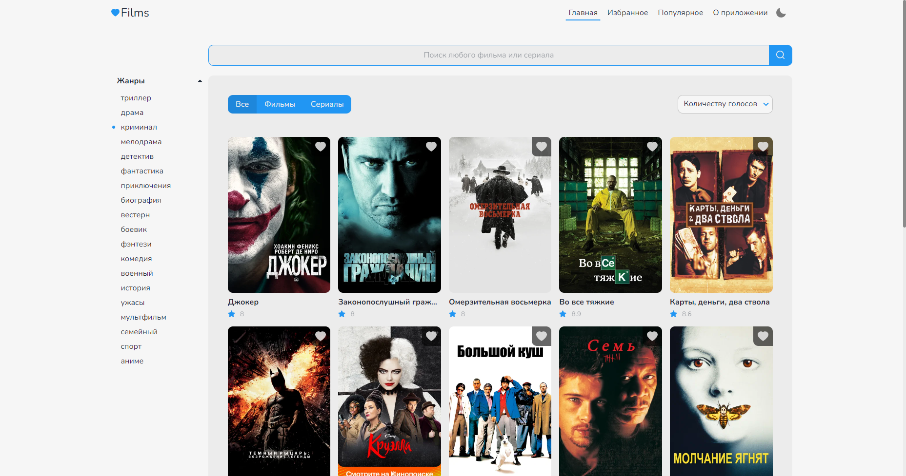
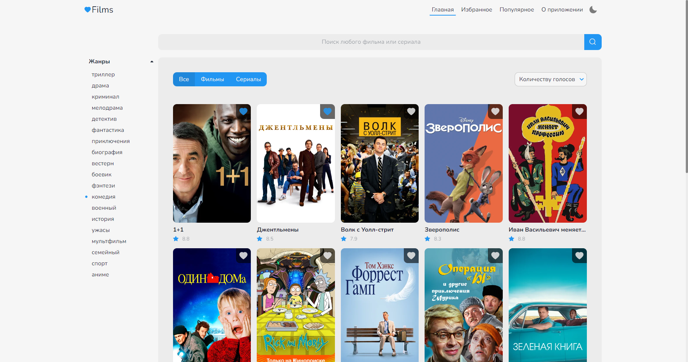
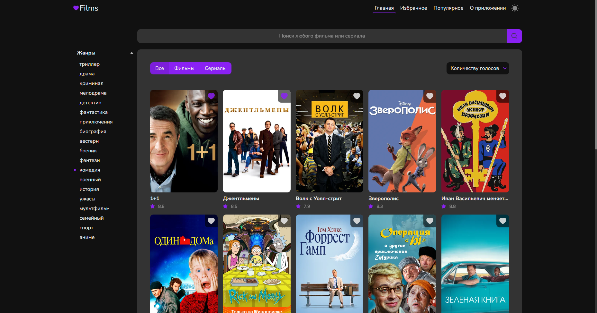

i# LoveFilms

>Приложение для поиска и составления коллекции фильмов и сериалов

## Технологии использованные в проекте
* React
* React Router
* Axios
* Swiper Slider

🔧 API используемый в проекте [Kinopoisk Api Unofficial](https://kinopoiskapiunofficial.tech/)

	<a href="#" target="_blank">
		
		Посмотреть в живую
	</a>

### Описание реализованного функционала

1. Просмотр коллекции фильмов по различным жанрам(триллер, драма, криминал, мелодрама, детектив, фантастика, приключения, биография, вестерн, боевик, фэнтези, комедия, военный, история, ужасы, мультфильм, семейный, спорт, аниме).
2. Возможность поиска фильма по ключевому слову или сортировка фильмов доступным фильтрам.
3. Составление списка избранных фильмов. 
4. Просмотр 100 популярных фильмов на данный момент.
5. Получение краткой информации о выбранном фильме.
6. Постраничная пагинация в основном разделе с фильмами. 
7. Infinity loading (при помощи Intersection Observer API) в разделе популярное.
8. Ленивая загрузка изображений для слайдера на странице с фильмом
9. Светлая и тёмная тема сайта

